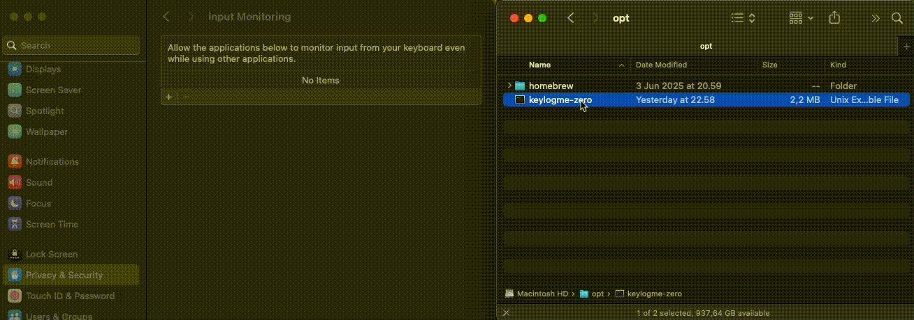
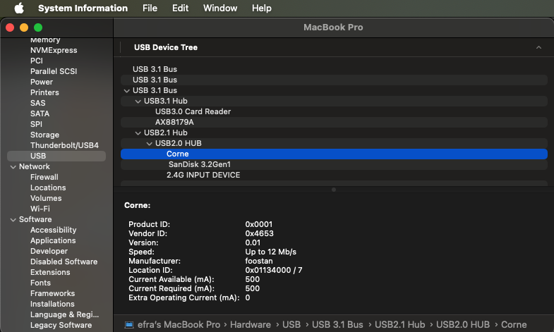

<!-- Improved compatibility of back to top link: See: https://github.com/othneildrew/Best-README-Template/pull/73 -->
<a id="readme-top"></a>
<!--


<!-- PROJECT LOGO -->
<br />
<div align="center">
  <a href="https://github.com/keylogme/keylogme-zero">
    
  </a>

  <h3 align="center">Keylogme Zero</h3>

  <p align="center">
    This is the zero trust logger for <a href="https://keylogme.com">keylogme.com</a>. This logger
    records your keypresses stats and saves them locally. You can visualize the stats in 
    <a href="https://keylogme.com/anonymous">keylogme.com/anonymous</a>.
    <br />
    <br />
    <a href="https://keylogme.com/esoteloferry/my-crkbd">View Demo</a>
    ·
    <a href="https://github.com/keylogme/keylogme-zero/issues/new?labels=bug&template=bug-report---.md">Report Bug</a>
    ·
    <a href="https://github.com/keylogme/keylogme-zero/issues/new?labels=enhancement&template=feature-request---.md">Request Feature</a>
  </p>
</div>


<!-- TABLE OF CONTENTS -->
<details>
  <summary>Table of Contents</summary>
  <ol>
    <li>
      <a href="#about-the-project">About The Project</a>
      <ul>
        <li><a href="#why?">Why?</a></li>
        <li><a href="#how?">How?</a></li>
        <li><a href="#what?">What?</a></li>
      </ul>
    </li>
    <li><a href="#security">Security</a></li>
    <li>
      <a href="#getting-started">Getting Started</a>
      <ul>
        <li><a href="#linux">Linux</a></li>
        <li><a href="#mac">Mac</a></li>
      </ul>
    </li>
    <li><a href="#config">Config</a>
      <ul>
        <li><a href="#config-linux">Linux</a></li>
        <li><a href="#config-mac">Mac</a></li>
      </ul>
    </li>
    <li><a href="#output">Output</a>
    <li><a href="#roadmap">Roadmap</a></li>
    <li><a href="#contributing">Contributing</a></li>
    <li><a href="#license">License</a></li>
    <li><a href="#contact">Contact</a></li>
    <li><a href="#acknowledgments">Acknowledgments</a></li>
  </ol>
</details>


<!-- ABOUT THE PROJECT -->
## About The Project

### Why?

The end goal is to avoid or diminish the pain in your hands due to typing. Commonly known as RSI (Repetitive Strain Injury), 
tennis elbow, carpal tunnel syndrome, etc.

There are many great ergonomic keyboards , beautiful hardware out there. However, what is the layout of keys 
that best suits you? that does not overload some fingers? that makes you more productive?.

We all started with QWERTY, then heard of DVORAK, COLEMAK, Workman, Norman, Asset, Capewell-Dvorak, BEAKL, MTGAP, QGMLWB... ?
Many layouts with a specific design criteria in mind but switching to one is not an easy task, you need a lot of practice and patience.

### How?

How can keylogme help?, here's how:

* Monitor : See the finger usage on your current layout based on your real usage
* Analyze : Compare your layout with others, find patterns to avoid or improve, remap shortcuts
* Adapt : fine tune or change your layout based on the stats

Of course, ergonomics is not just a nice keyboard and layout. It is also about posture, breaks, exercises.

### What?

So what is keylogme? well guessed, it is a keylogger!. You configure to track specific devices
you want to track. And it runs 24/7 in your computer as a service, collecting your keystrokes. 

There are 2 ways to use keylogme:

1. <a href="https://github.com/keylogme/keylogme-zero">keylogme-zero</a>: zero dependecies open source project that saves your stats locally. 
2. <a href="https://github.com/keylogme/keylogme-one">keylogme-one</a>: wrapper around keylogme-zero that saves your keystrokes in our server. 

What the f***? This is not safe! people will know what I write!
Our end goal is to have a heatmap of your keyboard usage, not to know what you write. See <a href="#security">Security section</a>
for more information on how we mingle your content so it is undecipherable.

<p align="right">(<a href="#readme-top">back to top</a>)</p>


## Security

A keylogger is a tool that records the keystrokes on a computer. It can be used for good or bad purposes.
Of course, our intention is to use it for good purposes. How can you trust that?, well:

1. The code is completely open source. 
2. It does not have 3rd party dependencies.
3. It stores your data locally in your computer (your data does not leave your computer).

The online viewer of your data does not need an account to use it. You can use it anonymously to visualize your stats. 

On top, there are security features to avoid anyone decoding the content you type.

Let's say you write : "hello world!"

A normal keylogger will get h, e, l, l, o, \b, w, o, r, l, d . Easy to know what you write.

There are 2 features in keylogme-zero that allows protection of the content. The content is the messages, passwords or anything that you type with meaning. The 
content is not the shortcuts, shifted states or changes of layer. The features are:

1. Baggage: when service starts, the keylogger will not save log until baggage is full. The baggage only lives in memory and is lost on service or computer restart.

    For example, with a baggage of size 5 (small value just for this example):

    A keylogger will not save anything until 'hello' (first 5 keystrokes) was typed. 
    Then, when '\b' is typed, '\b' will go to baggage and one randomly selected from baggage will come out to be saved.

    Then keylogger will get _, _, _, _, _, l, e, h, \b, o, l

    If you start the service today, collect 1000 keystrokes as baggage and then you have a good amount of
    randomness. The baggage will be used as long as the service runs, if you restart the service or turn off/on your
    computer then the baggage has to be refilled again.

2. Ghost codes: filter out alphanumeric keys you don't want to track.

Both features work on non shifted states, meaning alphabet, numbers and some symbols that do not require shift.

<p align="right">(<a href="#readme-top">back to top</a>)</p>

<!-- GETTING STARTED -->
## Getting Started

### Linux

1. Clone the repo
   ```sh
   git clone https://github.com/keylogme/keylogme-zero.git
   ```
2. Go to deploy and install with sudo permissions. There is a default config template (default_config_linux.json.template) 
   ```sh
   cd deploy && sudo -E ./install.sh
   ```
    <details>
      <summary>With parameters</summary>
       If you want to install a specific version:
       ```sh
       cd deploy && sudo -E ./install.sh v1.1.0
       ```
       If you want to install and use your own config (don't forget the version, in this case latest):
       ```sh
       cd deploy && sudo -E ./install.sh latest /absolute/path/to/your/config.json
       ```
    </details>

3. Press some keypresses, the output file is periodically saved (default value every 20 seconds) so after some time 
check the stats in the output file. The ouput file is defined in config file -> storage -> file_output 
(default output_file is `~/.keylogme/output_keylogme_zero.json`)


<p align="right">(<a href="#readme-top">back to top</a>)</p>

### Mac

1. Clone the repo
   ```sh
   git clone https://github.com/keylogme/keylogme-zero.git
   ```
2. Go to deploy and install with sudo permissions. There is a default config template (default_config_darwin.json.template)
   ```sh
   cd deploy && sudo -E ./install.sh
   ```
    <details>
        <summary>With parameters</summary>
        If you want to install a specific version:
        ```sh
        cd deploy && sudo -E ./install.sh v1.1.0
        ```
        If you want to install and use your own config (don't forget the version, in this case latest):
        ```sh
        cd deploy && sudo -E ./install.sh latest /absolute/path/to/your/config.json
            ```
    </details>

    Important! Give permissions to Input Monitoring

    Why?
    MacOS does not allow to read keypresses per each device. We have to grant 
    a special permission called Input Monitoring located in Settings -> Privacy & security. 
    We want to get stats per each device, f.e. your keyboard usage on your laptop's built-in keyboard
    or an external keyboard can have a different impact.

    The installation will guide you on how to give permissions of Privacy & security > Input monitoring to binary.

    


3. Press some keypresses, the output file is periodically saved (default value every 20 seconds) so after some time 
check the stats in the output file. The ouput file is defined in config file -> storage -> file_output 
(default output_file is `~/.keylogme/output_keylogme_zero.json`)

<p align="right">(<a href="#readme-top">back to top</a>)</p>

<!-- Config EXAMPLES -->
## Config

The file `deploy/default_config_darwin.json.template` and `deploy/default_config_linux.json.template` contains the default config for both OS. 
You can use it as a template to create your own config.

The config has two main sections:

- keylog : config for keylogger
    - devices : list of devices to monitor
        - device_id : unique id (4 alphanumeric characters) for the device
        - name : name of the device, you named it as you want.
        - keylogger: identification of device. 
            - product_id & vendor_id: ids of the device. How to get them? <a href="#config-linux>Linux</a> <a href="#config-mac">Mac</a>
        - layers: (OPTIONAL) for some keyboards that have multiple layers. Others that only have one layer, like the built-in keyboard, there is no need to define this parameter.
            - layer_id : unique id (int) for the layer
            - name : name of the layer
            - codes : list of keycodes or shifted states (decimal format) for the layer. Go to <a href="#keycodes-hardware">Keycodes hardware</a> section to know how to get it.
    - shortcuts : list of shortcuts to monitor
        - id : unique id for the shortcut
        - codes : list of keycodes (decimal format) for the shortcut. Go to <a href="#keycodes-hardware">Keycodes hardware</a> section to know how to get it.
        - type : type of shortcut. There are two: `hold` for holding shortcuts like copy (CTRL+C)
            and `seq` for sequential shortcuts like used in (neo)vim for shortcuts.
    - shift_state:
        - threshold_auto: some firmware like QMK allows to define a shifted combo to one physical key. The firmware triggers the shift key hold and the letter/symbol 
            automatically, this threshold is a time like "5ms" that will diferentiate human or software triggered shifted combos.
    - security:
        - baggage_size: on binary start, the keystrokes are not saved in order or complete. 
        - ghosting_codes: keystrokes to not save
- storage : config for storage
    - file_output : absolute filepath to store the stats
    - periodic_save_in_sec : periodic time to save the stats. In seconds.


<p align="right">(<a href="#readme-top">back to top</a>)</p>

### Config Linux

A usb device connected to a Linux computer has a device file in /dev/input folder. One device 
may have multiple device files associated, each file would have a purpose (called Device Page in HID Usage Tables for USB v1.6), a
keyboard can have also volume controls or an embedded mouse.  The device file will register the events from the keyboard. 

In keylogme-zero for Linux, you get the product and vendor id of the device by using following command:

```sh
apt install input-utils

sudo lsinput
```

Find your keyboard (it may appear once or multiple times) and use the product and vendor id.

For example, the output of the command for my corne keyboard is below. 

<details>
  <summary>Output of command lsinput related to keyboard</summary>

```sh
/dev/input/event12
   bustype : BUS_USB
   vendor  : 0x4653
   product : 0x1
   version : 273
   name    : "foostan Corne"
   phys    : "usb-0000:00:14.0-4.3/input0"
   uniq    : ""
   bits ev : (null) (null) (null) (null) (null)
```
</details>

<p align="right">(<a href="#readme-top">back to top</a>)</p>


### Config Mac

Go to System Information and find Product Id and Vendor Id of device in USB or Bluetooth.

Your built-in keyboard of your laptop is in SPI. There is an issue getting events from
the built-in trackpad therefore at the monent, keylogme-zero does not support the built-in trackpad.

MacOS does not expose a device file to read the events. The events on each keyboard must be read from 
the IOKit framework MacOS offers, the IOHIDManager. To register a device, you must find its 
product id and vendor id in System Information.



<p align="right">(<a href="#readme-top">back to top</a>)</p>

### Keycodes hardware

A key (hardware) has a keycode, f.e. in a normal QWERTY keyboard, the keycode of Q is 
10(HEX) and 16(Decimal), letter C is 2E(HEX) and 46(Decimal). 

The keyboard (hardware) sends the keycode to the computer. The computer uses the
keyboard layout to convert the keycode to a character. The keyboard layout is defined 
in your operating system. For example, the layout US QWERTY will convert 16(Decimal) to Q 
and 46(Decimal) to C. But if I have defined another layout, for example 
[WORKMAN](https://workmanlayout.org/), then keycode 16(Decimal)
will be Q and 46(Decimal) will be M. You get the idea 🙃

How to know the keycode?
Go to [kbdlayout.info](https://kbdlayout.info/kbdus)
and click scancodes to see the keycodes. 
The scancode is a hex number, you have to convert it to decimal.

<p align="right">(<a href="#readme-top">back to top</a>)</p>

## Output 

The output file has the format below. You can use it to visualize heatmap of your usage
in [keylogme.com/anonymous](https://keylogme.com/anonymous) and play with different layouts and keyboards.

```json
{
    "keylogs":{"<device_id>":{"<keycode>":"<count>"}},
    "shortcuts": {"<device_id>":{"<shortcut_id>":"<count>"}},
}
```
<p align="right">(<a href="#readme-top">back to top</a>)</p>

<!-- ROADMAP -->
## Roadmap

- [x] Keylog multiple devices
- [x] Handle connection/disconnection of devices
- [x] Handle shortcuts
    - [x] Hold shortcuts: like copy (Ctrl+C)
    - [x] Sequential shortcuts: like used in (neo)vim for shortcuts
- [x] Local storage of stats
- [ ] Installation script and keylogger compatible with
    - [x] Linux
    - [x] Mac
    - [ ] Windows
- [x] Security features for not knowing what you write
    - [x] Baggage (buffer of keys)
    - [x] Ghost codes (not trackable keys)
- [x] Shifted keys
- [x] Layer changes
- [ ] Performance WPM
- [ ] Accuracy

See the [open issues](https://github.com/keylogme/keylogme-zero/issues) for a full list of proposed features (and known issues).

<p align="right">(<a href="#readme-top">back to top</a>)</p>


<!-- CONTRIBUTING -->
## Contributing

Contributions are what make the open source community such an amazing place to learn, inspire, and create. Any contributions you make are **greatly appreciated**.

If you have a suggestion that would make this better, please fork the repo and create a pull request. You can also simply open an issue with the tag "enhancement".
Don't forget to give the project a star! Thanks again!

1. Fork the Project
2. Create your Feature Branch (`git checkout -b feature/AmazingFeature`)
3. Commit your Changes (`git commit -m 'Add some AmazingFeature'`)
4. Push to the Branch (`git push origin feature/AmazingFeature`)
5. Open a Pull Request


<!-- LICENSE -->
## License

Distributed under the MIT License. See `LICENSE` for more information.

<p align="right">(<a href="#readme-top">back to top</a>)</p>


<!-- CONTACT -->
## Contact

Efrain Sotelo - [@esoteloferry](https://twitter.com/esoteloferry)

Project Link: [https://keylogme.com](https://keylogme.com)

<p align="right">(<a href="#readme-top">back to top</a>)</p>


<!-- ACKNOWLEDGMENTS -->
## Acknowledgments

Helpful resources and would like to give credit to. 

* [Linux keylogger](https://github.com/MarinX/keylogger) helpful starting point

<p align="right">(<a href="#readme-top">back to top</a>)</p>


